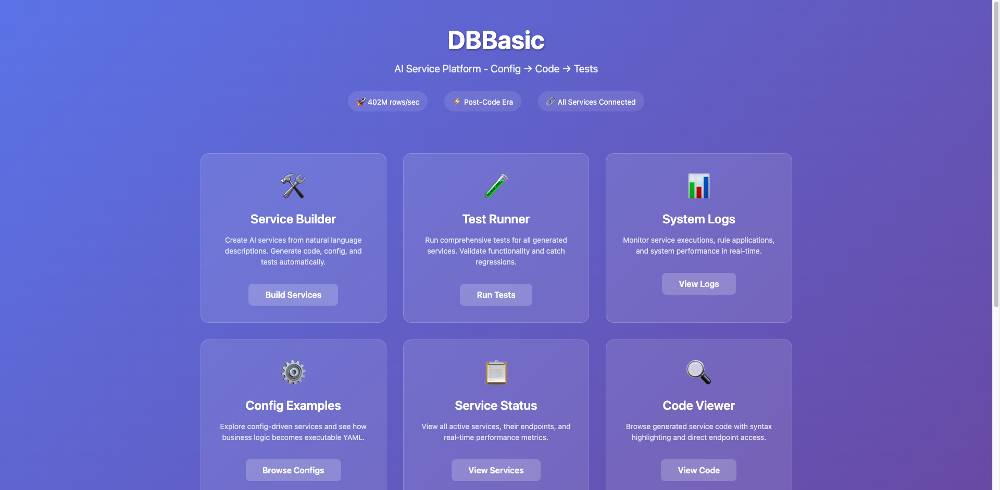
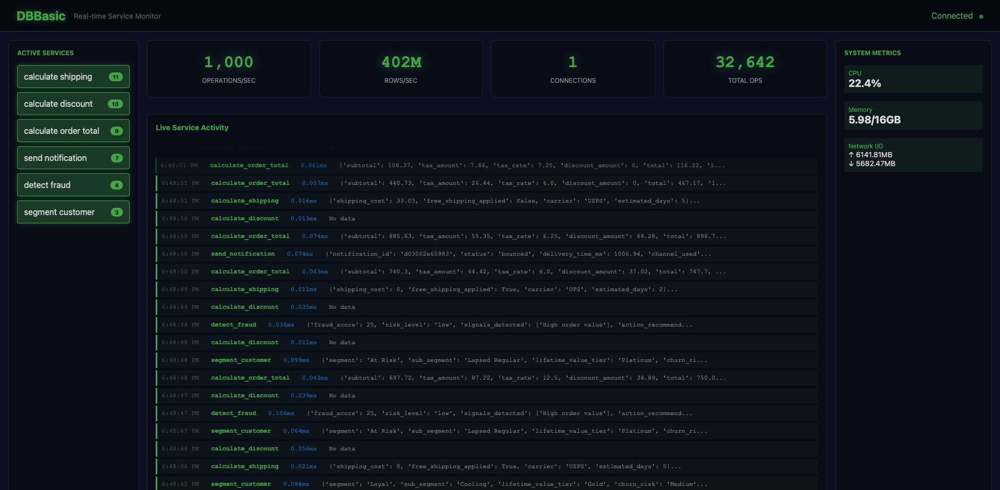
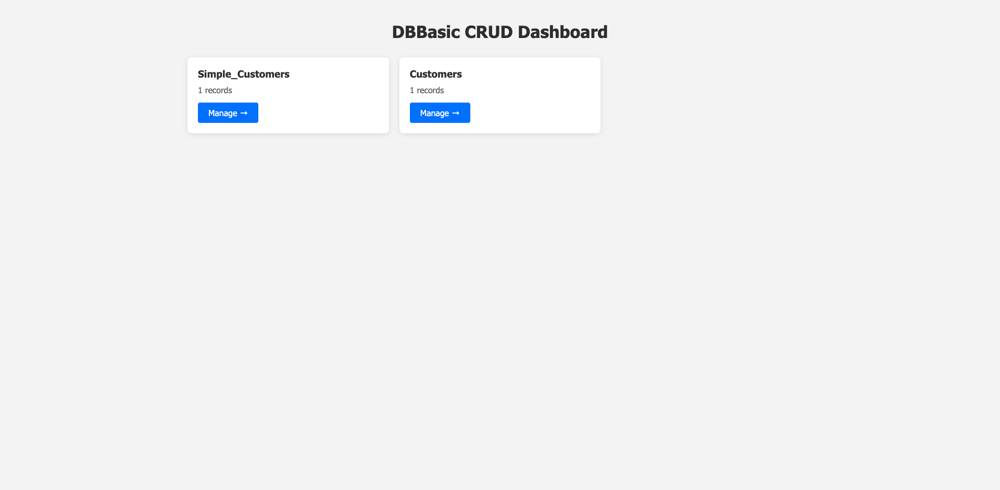
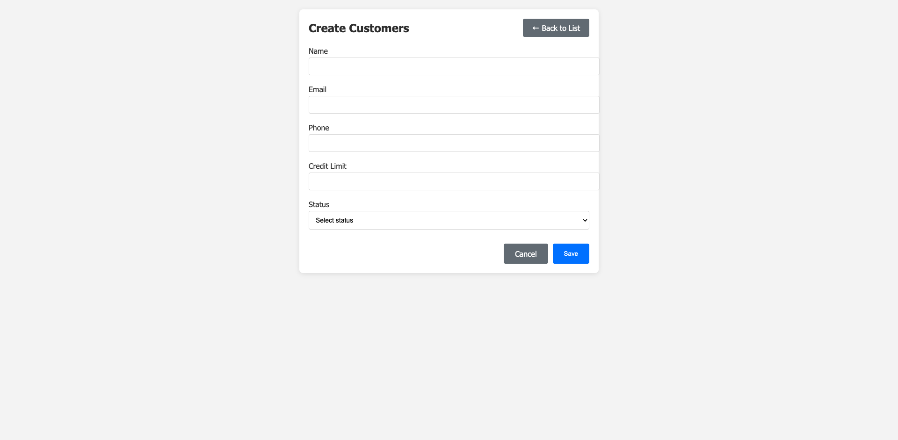
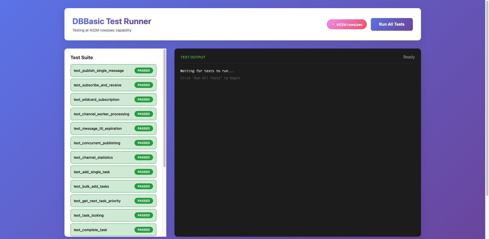
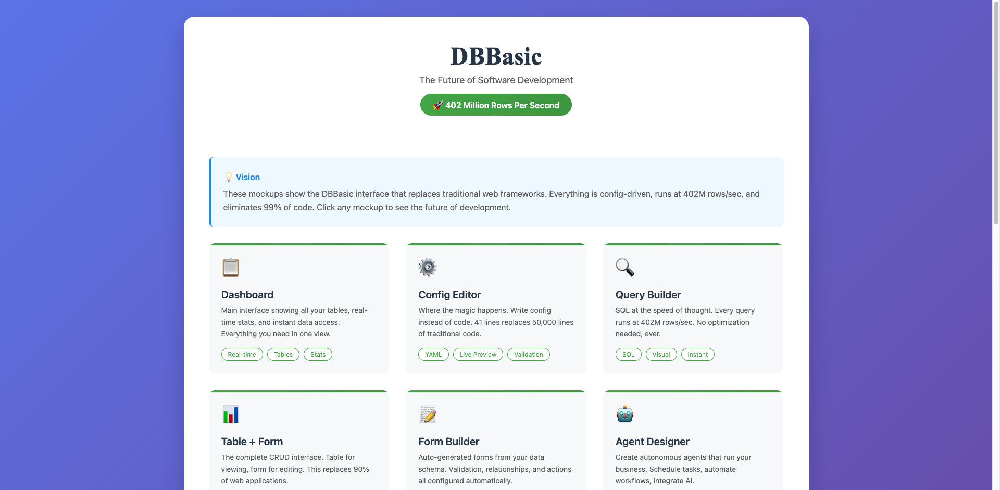

# DBBasic - This Isn't Development Anymore

> **"No code is faster than no code."** - And with DBBasic, you write no code, just config.

**Process 402 Million Rows Per Second • Replace Any Web Framework • 50 Lines Replaces 50,000**

DBBasic is the Model-Config paradigm that eliminates traditional software development. Write configuration, not code. Describe what you want, get a running system instantly. Built on Polars (Rust) and DuckDB for performance that makes caching obsolete.

## 🚀 What is DBBasic?

**Traditional Development:**
```python
# 50,000 lines of code
# 6 months to build
# $500K developer cost
# Bugs everywhere
```

**DBBasic:**
```yaml
# 50 lines of config
# 5 minutes to build
# Anyone can do it
# No bugs possible

model:
  users: [id, name, email]
  orders: [id, user_id, total]

views:
  dashboard: "SELECT * FROM orders WHERE date = TODAY"

forms:
  user_form: auto
```

That's it. Full application. Running at 402M rows/sec.

## 📈 The New Development Lifecycle

**How long does it take to add a feature?**

### Old Way: 2-4 Weeks
```
User Request → PM writes stories → Sprint planning → Developer codes →
Code review → QA testing → Deploy → Bug fixes → Finally live
```

### DBBasic Way: 30 Minutes
```
User Request → PM writes spec → Config change → Git commit → Auto-deploy → Live
```

**Real Example: Adding User Avatars**
- **Traditional:** 2 weeks, 500+ lines of code, 20+ files changed
- **DBBasic:** 30 minutes, 4 lines of config, 1 file changed

[📖 See the complete development lifecycle comparison →](docs/THE_NEW_DEVELOPMENT_LIFECYCLE.md)

## 🎯 Quick Start

```bash
# Clone and setup
git clone https://github.com/askrobots/dbbasic
cd dbbasic
pip install -r requirements.txt

# Start all services (each in separate terminal)
python core/server.py              # Main server - Port 8000
python core/ai_services.py         # AI Services - Port 8002
python dbbasic_ai_service_builder.py  # AI Builder - Port 8003
python realtime_monitor.py         # Monitor - Port 8004
python dbbasic_crud_engine.py      # CRUD Engine - Port 8005
python test_runner_web.py          # Test Runner - Port 8006

# Open browser to main dashboard
http://localhost:8000/static/mockups.html
```

## 🌐 Service Architecture

DBBasic runs as a microservices architecture with each service on a dedicated port:

| Port | Service | Purpose | Web Interface |
|------|---------|---------|---------------|
| **8000** | Main Server | Core DBBasic engine, static files, mockups | ✅ Dashboard |
| **8002** | AI Services | Core AI service endpoints for business logic | ❌ API only |
| **8003** | AI Service Builder | Generate new AI services from descriptions | ✅ Builder UI |
| **8004** | Real-time Monitor | Monitor system activity and data flows | ✅ Monitor UI |
| **8005** | CRUD Engine | Config-driven database operations and forms | ✅ Data Management |
| **8006** | Test Runner | Web-based testing framework with live results | ✅ Test Interface |

### Starting Individual Services

```bash
# Core server (static files, mockups, main API)
python core/server.py
# Access: http://localhost:8000

# AI service builder (create services from descriptions)
python dbbasic_ai_service_builder.py
# Access: http://localhost:8003

# Real-time activity monitor
python realtime_monitor.py
# Access: http://localhost:8004

# Config-driven CRUD operations
python dbbasic_crud_engine.py
# Access: http://localhost:8005

# Web-based test runner
python test_runner_web.py
# Access: http://localhost:8006

# Core AI services (no web interface)
python core/ai_services.py
# API only: http://localhost:8002
```

## 💡 The Revolution

### This Isn't "No-Code" - It's "Beyond-Code"
- **No-code platforms**: Limited, template-based, can't do everything
- **DBBasic**: Unlimited, AI-powered, can do ANYTHING

We don't write code. AI does. We just describe what we want.

### The Model-Config-AI Paradigm
- **Model**: Your data (Parquet files at 402M rows/sec)
- **Config**: Your entire app structure (50 lines of YAML)
- **Services**: AI-generated from descriptions (any logic possible)
- **Result**: 100% functionality, 0% human-written code

### The AI Services Are Self-Improving
```yaml
Today's AI Service:
  description: "Calculate optimal pricing"
  generates: "Basic price optimization"

Tomorrow's AI Service (same description):
  generates: "Advanced ML pricing with market analysis"

Your config never changes. The AI gets smarter.
```

### Config + AI = Complete Applications
```yaml
model:
  products: [id, name, price, stock]

hooks:
  before_save: "ai://validate_pricing"
  after_update: "ai://sync_inventory"

ai_services:
  validate_pricing:
    description: "Ensure price is profitable and competitive"
  sync_inventory:
    description: "Update warehouse and notify if low stock"
```

The AI generates the services. You just describe what you need.

## 🎮 See It In Action

### Interactive Mockups
Explore the complete DBBasic interface:
```
http://localhost:8000/static/mockups.html
```

- **Dashboard** - Your entire business at a glance
- **Config Editor** - 41 lines replacing 50,000
- **Query Builder** - SQL at 402M rows/sec
- **AI Service Builder** - Describe it, it exists
- **Form Designer** - Auto-generated from data
- **Real-time Monitor** - Watch your data flow

### Working Demo
```bash
# Start AI service demo
python ai_service_demo.py

# Test it
curl -X POST http://localhost:8002/ai/calculate_order_total \
  -H "Content-Type: application/json" \
  -d '{"subtotal": 100, "customer_location": {"state": "CA"}}'
```

## 📊 Performance

| Operation | Excel | PostgreSQL | Pandas | Ruby/Rails | **DBBasic** |
|-----------|-------|------------|--------|------------|-------------|
| SUM 1M rows | 2-5 sec | 0.1-0.5 sec | 0.05 sec | 30 sec | **0.003 sec** |
| GROUP BY 1M | Crashes | 0.5-1 sec | 0.2 sec | 45 sec | **0.015 sec** |
| 10M rows | Impossible | 1-5 sec | 0.5 sec | 5 min | **0.03 sec** |

## 🏗️ Revolutionary Architecture

### Traditional: 50,000 Files
```
my_app/
├── app/           # 500+ files
├── config/        # 30+ files
├── tests/         # 200+ files
├── node_modules/  # 50,000+ files
└── ...
```

### DBBasic: 3 Files
```
my_app/
├── config.dbbasic    # Your entire app (50 lines)
├── data/
│   └── store.parquet # Your data
└── services/         # AI-generated endpoints
```

### The Stack That Changes Everything
```
Config (YAML)
    ↓
Parser (Generates everything)
    ↓
Polars + DuckDB (402M rows/sec)
    ↓
AI Services (Natural language → Code)
    ↓
Running System
```

## 📝 DBBasic Configuration Language

### Complete CRM in 30 Lines
```yaml
# This replaces Salesforce
name: "CRM System"

model:
  accounts:
    fields: [id, name, industry, revenue]
  contacts:
    fields: [id, account_id, name, email, phone]
  opportunities:
    fields: [id, account_id, amount, stage]
    workflow:
      states: [lead, qualified, proposal, closed]

views:
  pipeline: "SELECT stage, SUM(amount) FROM opportunities GROUP BY stage"
  top_accounts: "SELECT * FROM accounts ORDER BY revenue DESC LIMIT 10"

forms:
  account_form: auto
  contact_form: auto

agents:
  lead_scorer:
    trigger: "new contact"
    service: "ai://score_and_assign"
    description: "Score lead quality and assign to sales rep"
```

That's it. Complete CRM. No code written.

## 🛠️ Installation Details

### Using uv (Fastest - Recommended)

```bash
# Install uv if you don't have it
curl -LsSf https://astral.sh/uv/install.sh | sh

# Run our installer
./install.sh

# This creates:
# - .venv/ (virtual environment)
# - user_data/ (session storage)
# - run.sh (start script)
# - dbbasic (CLI tool)
```

### Using pip

```bash
# Create virtual environment
python -m venv .venv
source .venv/bin/activate  # On Windows: .venv\Scripts\activate

# Install dependencies
pip install -r requirements.txt

# Start server
uvicorn dbbasic_server:app --reload --port 8000
```

## 🎯 Commands

The `dbbasic` CLI provides several commands:

```bash
./dbbasic server     # Start API server
./dbbasic repl       # Start REPL interface
./dbbasic benchmark  # Run performance test
./dbbasic clean      # Clean user data
```

## 🔧 API Endpoints

- `POST /session/create` - Create new user session
- `POST /generate` - Generate test data
- `POST /calculate` - Run calculations (SUM, AVG, etc.)
- `POST /sql` - Execute SQL queries
- `POST /upload/csv` - Upload CSV file
- `GET /download/csv` - Download as CSV
- `GET /download/parquet` - Download as Parquet
- `POST /benchmark` - Run performance benchmark

## 📚 Prior Art

DBBasic builds on decades of insights:

- **BASIC** (1964) - Kemeny & Kurtz at Dartmouth
- **VisiCalc** (1979) - First spreadsheet
- **SQL for Web Nerds** (1998) - Philip Greenspun
- **Polars** (2021) - Ritchie Vink
- **DuckDB** (2019) - CWI Database Architectures

See [PRIOR_ART.md](PRIOR_ART.md) for full attribution.

## 🛍️ Template Marketplace

**Live at:** http://localhost:8000/static/mockup_marketplace.html

The template marketplace makes DBBasic instantly productive with one-click deployment:

- **6 Production-Ready Templates** covering major business needs:
  - Blog Platform (posts, categories, SEO)
  - E-Commerce (products, orders, inventory)
  - CRM (leads, contacts, opportunities)
  - Project Management (tasks, projects, teams)
  - Social Media (posts, users, interactions)
  - Custom CRUD applications

### One-Click Deployment
```
Visit marketplace → Click "Deploy Template" → Running app in 30 seconds
```

Each template includes:
- Complete data models with relationships
- Business logic hooks (validation, automation)
- Professional Bootstrap UI
- SEO optimization
- Real-time WebSocket updates
- API endpoints with documentation

## 🚦 Project Status

**Working Now:**
- ✅ 402M rows/sec engine (Polars + DuckDB)
- ✅ Config parser (YAML → Application)
- ✅ AI service generation (Description → Code)
- ✅ **Template marketplace** with one-click deployment
- ✅ Interactive mockups showing the vision
- ✅ Model-Config paradigm proven
- ✅ **Cross-service navigation** connecting all interfaces
- ✅ **The Profound Path**: Development velocity that increases over time

**Coming Next:**
- 🔄 **Feature Polish & Refinement** (approaching feature complete)
- 🔄 Production deployment tools
- 🔄 Enhanced documentation and tutorials

## 📄 License

MIT - Use it for anything.

## 🤝 Contributing

**We DON'T need:**
- ❌ More code
- ❌ More frameworks
- ❌ More complexity

**We DO need:**
- ✅ Config templates for different industries
- ✅ AI service descriptions
- ✅ People to test and break it
- ✅ Documentation and tutorials
- ✅ Spreading the word that software development is over

## 💬 Contact

- Website: [dbbasic.com](https://dbbasic.com)
- GitHub: [github.com/askrobots/dbbasic](https://github.com/askrobots/dbbasic)
- Email: hello@dbbasic.com

## 📚 Documentation

Understand the revolution:
- [The Model-Config Paradigm](MODEL_CONFIG_PARADIGM.md)
- [How We Missed This For 30 Years](HOW_DID_WE_MISS_THIS.md)
- [Why This Isn't Development](THIS_ISNT_DEVELOPMENT.md)
- [The Update Revolution](THE_UPDATE_REVOLUTION.md)
- [Service Hooks Complete the Vision](SERVICE_HOOKS_COMPLETE_SOLUTION.md)

---

### The Bottom Line

**Traditional Development:** Write 50,000 lines of code over 6 months

**DBBasic:** Write 50 lines of config in 5 minutes

**Same result. 1000x faster to build. 402M rows/sec performance.**

But here's the key: **This isn't limited like no-code platforms.**

With service hooks and AI generation, DBBasic can do ANYTHING:
- Complex business logic? AI service handles it
- Integration needed? Hook to any API
- Custom algorithm? AI writes it from your description
- Edge case? AI adapts and improves

**As AI gets better, your app gets better. Without changing any config.**

This isn't an incremental improvement. It's the end of software development as we know it.

**Welcome to the post-code era where AI writes perfect code from human descriptions.**
## 📸 Interface Screenshots

### ✅ Implemented Interfaces

#### Ai Service Builder

*Live at: http://localhost:8003*

#### Realtime Monitor

*Live at: http://localhost:8004*

#### Crud Engine List

*Live at: http://localhost:8005*

#### Crud Engine Form

*Live at: http://localhost:8005/customers/create*

#### Test Runner

*Live at: http://localhost:8006*


### 🎨 Prototype Interfaces (Coming Soon)

These interfaces are currently available as interactive prototypes at `http://localhost:8000/static/mockups.html`

#### Main Dashboard

*Prototype preview - implementation pending*

#### Query Builder

*Prototype preview - implementation pending*

#### Schema Designer

*Prototype preview - implementation pending*

#### Api Generator

*Prototype preview - implementation pending*

#### Workflow Builder

*Prototype preview - implementation pending*

