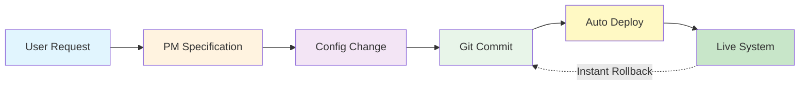

# The New Development Lifecycle
## How Software Development Actually Works Now

### The Old Way (2000-2025)
```
User Request
    ↓ (days)
Product Manager writes User Stories
    ↓ (days)
Sprint Planning & Estimation
    ↓ (days)
Developer writes Code
    ↓ (hours)
Code Review
    ↓ (hours)
QA Testing
    ↓ (hours)
Deployment Pipeline
    ↓ (15+ minutes)
Production
    ↓
Bug Found → Start Over

Total: 2-4 weeks per feature
```

### The DBBasic Way (2025+)
```
User Request
    ↓ (minutes)
PM writes Specification
    ↓ (seconds)
AI generates Config Change
    ↓ (instant)
Git Commit (version controlled)
    ↓ (3 seconds)
Automatic Validation
    ↓ (instant)
System Updates Itself

Total: 30 minutes per feature
```

## Visual Process Flow



## The Three Layers

### Layer 1: Requirements (Why)
```yaml
requirement: "Users need to filter orders by date"
reason: "Too many orders to scroll through"
success: "Find orders quickly"
```

### Layer 2: Specification (What)
```yaml
specification:
  feature: date_filter

  interface:
    type: date_range_picker
    default: last_30_days
    format: MM/DD/YYYY

  behavior:
    on_change: refresh_results
    validation: end_date >= start_date
```

### Layer 3: Config (How)
```yaml
pages:
  /orders:
    filters:
      date_range:
        type: date_picker
        query: "WHERE date BETWEEN ? AND ?"
```

## Real Example: Adding User Avatars

### Traditional Process (2 weeks)
1. **Day 1-2:** User story writing & grooming
2. **Day 3:** Sprint planning (4 story points)
3. **Day 4-8:** Development
   - Update database schema
   - Write upload controller
   - Add image processing
   - Update user model
   - Modify all views
   - Write tests
4. **Day 9:** Code review & fixes
5. **Day 10:** QA testing
6. **Day 11:** Bug fixes
7. **Day 12:** Deployment to staging
8. **Day 13:** Final testing
9. **Day 14:** Production deployment

**Lines of code changed: 500+ across 20 files**

### DBBasic Process (30 minutes)
1. **Minute 1-5:** PM writes specification
```yaml
feature: user_avatars
specification:
  storage: cloud
  formats: [jpg, png]
  max_size: 5MB
  display: circle_crop
```

2. **Minute 6-10:** AI generates config changes
```yaml
data:
  users: +avatar_url

uploads:
  avatars: configured

pages:
  /profile: +show_avatar
```

3. **Minute 11:** Git commit
```bash
git commit -m "Add user avatars feature"
```

4. **Minute 12:** System updates

**Lines changed: 4 additions to config**

## Version Control That Makes Sense

### Old Git History
```bash
a1b2c3d Fix avatar upload bug
b2c3d4e Update tests for avatar
c3d4e5f Refactor image processing
d4e5f6g Add avatar to user model
e5f6g7h Create upload controller
f6g7h8i Update avatar styles
g7h8i9j Fix broken tests
h8i9j0k Merge branch 'feature/avatars'
```

### DBBasic Git History
```bash
a1b2c3d Add user avatars
b2c3d4e Add date filtering to orders
c3d4e5f Increase upload limit to 10MB
d4e5f6g Add customer loyalty points
e5f6g7h Enable two-factor authentication
```

**Each commit is a complete feature, not a code change!**

## The New Roles

| Old Role | New Role | What They Do |
|----------|----------|--------------|
| Product Manager | Specification Designer | Writes precise specifications |
| Developer | Config Engineer (or AI) | Refines config changes |
| QA Tester | Validation Rules | Automated in config |
| DevOps | Auto-Deploy System | Config triggers updates |
| Scrum Master | Nobody | Not needed |

## Instant Rollback

Something broke? One command:
```bash
git revert HEAD
# Feature removed. System restored. 3 seconds.
```

## A/B Testing Native

```yaml
experiments:
  new_checkout:
    control: current_checkout.config
    variant: simplified_checkout.config
    split: 50/50
    measure: conversion_rate
    auto_winner: after_1000_conversions
```

## Benefits Summary

| Aspect | Old Way | DBBasic Way | Improvement |
|--------|---------|-------------|-------------|
| Time to deploy | 2-4 weeks | 30 minutes | **40x faster** |
| Lines changed | 500+ | 5-10 | **50x less** |
| Files touched | 20+ | 1 | **20x simpler** |
| People involved | 5-10 | 1-2 | **5x efficient** |
| Rollback time | Hours/Days | 3 seconds | **1000x faster** |
| Bug potential | High | Near zero | **Eliminated** |

## The Bottom Line

**Old Way:** Write code → Test code → Deploy code → Fix bugs → Repeat

**New Way:** Specify want → Config changes → System updates → Done

---

## See It In Action

1. User: "I need to export to PDF"
2. PM Specification (5 min):
```yaml
export:
  formats: +pdf
  button: "Download as PDF"
```
3. Git commit: `"Add PDF export"`
4. Live in production (instantly)

**No sprints. No code. No bugs. Just value delivered.**

---

*"We turned software development from a 2-week sprint into a 30-minute task."*

Welcome to the post-code era where features are configurations, not code.